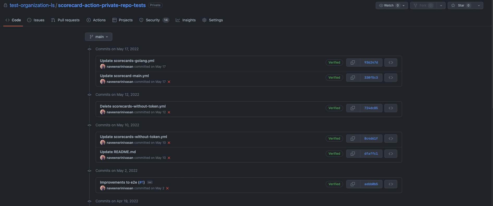

## Maintenance of scorecard
| #   | Title                                    | URL                                              |
|-----|------------------------------------------|--------------------------------------------------|
| 1   | :seedling: Included Stargazers over time | https://github.com/ossf/scorecard/pull/1971      |
| 3   | :seedling: Fixes vulnerability in go-tuf | https://github.com/ossf/scorecard/pull/1969      |
| 4   | :seedling: Upgrade to go 1.18            | https://github.com/ossf/scorecard/pull/1949      |
| 5   | Fixed codeql to include Javascript       | https://github.com/ossf/scorecard-webapp/pull/92 |

## Using Cosign to sign images
| #   | Title                                    | URL                                         |
|-----|------------------------------------------|---------------------------------------------|
| 1   | 🌱 Signing scorecard images using cosign | https://github.com/ossf/scorecard/pull/1970 |

## Deprecate Scorecard V1 schema
| #   | Title                                                             | URL                                         |
|-----|-------------------------------------------------------------------|---------------------------------------------|
| 1   | ⚠️  Remove the old Details field from CheckResult                 | https://github.com/ossf/scorecard/pull/1906 |
| 2   | :warning: Remove the pass from the `CheckResult`                  | https://github.com/ossf/scorecard/pull/1899 |
| 3   | :warning: Removing the confidence field from `CheckResult` struct | https://github.com/ossf/scorecard/pull/1896 |
| 4   | :warning: Remove the oldjson format from cron                     | https://github.com/ossf/scorecard/pull/1920 |

## Testing of Scorecard action 
As part of testing Scorecard action commits were created across in many repositories without pull requests.
 https://github.com/ossf-tests/scorecard-action/commits/main?author=naveensrinivasan
 This is a private github repository for testing Scorecard action.

## Pull Requests Reviewed by Naveen Srinivasan for May-2022
| #   | Title                                                                                               | URL                                                |
|-----|-----------------------------------------------------------------------------------------------------|----------------------------------------------------|
| 1   | :seedling: Bump github.com/caarlos0/env/v6 from 6.9.2 to 6.9.3                                      | https://github.com/ossf/scorecard-action/pull/322  |
| 2   | :seedling: Bump debian from `fbaacd5` to `06a93cb`                                                  | https://github.com/ossf/scorecard-action/pull/321  |
| 3   | :seedling: Bump actions/setup-go from 3.1.0 to 3.2.0                                                | https://github.com/ossf/scorecard-action/pull/320  |
| 4   | :seedling: Bump actions/setup-go from 3.1.0 to 3.2.0                                                | https://github.com/ossf/scorecard/pull/1968        |
| 5   | :seedling: Bump crazy-max/ghaction-import-gpg from 4.4.0 to 5                                       | https://github.com/ossf/scorecard/pull/1967        |
| 6   | :seedling: Bump github.com/jszwec/csvutil from 1.6.0 to 1.7.0                                       | https://github.com/ossf/scorecard/pull/1966        |
| 7   | :seedling: Bump ossf/scorecard-action from 1.0.4 to 1.1.0                                           | https://github.com/ossf/scorecard/pull/1963        |
| 8   | ✨ Update container hash for v1.1.0                                                                  | https://github.com/ossf/scorecard-action/pull/314  |
| 9   | :seedling: Bump actions/dependency-review-action from 1.0.1 to 1.0.2                                | https://github.com/ossf/scorecard-webapp/pull/97   |
| 10  | :seedling: Bump actions/dependency-review-action from 1.0.1 to 1.0.2                                | https://github.com/ossf/scorecard/pull/1952        |
| 11  | :seedling: Bump mvdan.cc/sh/v3 from 3.5.0 to 3.5.1                                                  | https://github.com/ossf/scorecard/pull/1951        |
| 12  | :seedling: Bump github.com/ossf/scorecard/v4 from 4.2.0 to 4.3.0                                    | https://github.com/ossf/scorecard-action/pull/313  |
| 13  | :seedling: Bump openssf/scorecard from v4.2.0 to v4.3.0                                             | https://github.com/ossf/scorecard-action/pull/312  |
| 14  | :seedling: Bump github/codeql-action from 2.1.10 to 2.1.11                                          | https://github.com/ossf/scorecard-action/pull/311  |
| 15  | 🌱 Replace `checker.Release` with `clients.Release`                                                 | https://github.com/ossf/scorecard/pull/1946        |
| 16  | 🌱 Replace `checker.CIIBadge` with `clients.CIIBadge`                                               | https://github.com/ossf/scorecard/pull/1945        |
| 17  | 🌱 Replace `checker.Issue` with `clients.Issue`                                                     | https://github.com/ossf/scorecard/pull/1944        |
| 18  | :seedling: Bump actions/upload-artifact from 3.0.0 to 3.1.0                                         | https://github.com/ossf/scorecard/pull/1941        |
| 19  | :seedling: Bump actions/upload-artifact from 3.0.0 to 3.1.0                                         | https://github.com/ossf/scorecard-webapp/pull/96   |
| 20  | Initial commit of the collect_signals command.                                                      | https://github.com/ossf/criticality_score/pull/120 |
| 21  | :seedling: Bump distroless/base from `764b74b` to `d65ac1a` in /cron/webhook                        | https://github.com/ossf/scorecard/pull/1931        |
| 22  | :seedling: Bump distroless/base from `764b74b` to `d65ac1a` in /cron/worker                         | https://github.com/ossf/scorecard/pull/1930        |
| 23  | :seedling: Bump distroless/base from `764b74b` to `d65ac1a` in /cron/controller                     | https://github.com/ossf/scorecard/pull/1929        |
| 24  | :seedling: Bump distroless/base from `764b74b` to `d65ac1a`                                         | https://github.com/ossf/scorecard/pull/1928        |
| 25  | :seedling: Bump github.com/rhysd/actionlint from 1.6.12 to 1.6.13                                   | https://github.com/ossf/scorecard/pull/1927        |
| 26  | :seedling: Bump distroless/base from `764b74b` to `d65ac1a`                                         | https://github.com/ossf/scorecard-webapp/pull/95   |
| 27  | :seedling: Bump github.com/rhysd/actionlint from 1.6.12 to 1.6.13                                   | https://github.com/ossf/scorecard-webapp/pull/94   |
| 28  | 🌱 Cron cleanup                                                                                     | https://github.com/ossf/scorecard/pull/1925        |
| 29  | :seedling: Bump github.com/golangci/golangci-lint from 1.46.0 to 1.46.2 in /tools                   | https://github.com/ossf/scorecard/pull/1924        |
| 30  | :seedling: Bump actions/dependency-review-action from 1.0.0 to 1.0.1                                | https://github.com/ossf/scorecard/pull/1923        |
| 31  | :seedling: Bump github.com/google/go-containerregistry from 0.8.0 to 0.9.0                          | https://github.com/ossf/scorecard/pull/1922        |
| 32  | :seedling: Bump github/codeql-action from 2.1.10 to 2.1.11                                          | https://github.com/ossf/scorecard-webapp/pull/93   |
| 33  | :seedling: Bump actions/setup-go from 3.0.0 to 3.1.0                                                | https://github.com/ossf/scorecard-action/pull/306  |
| 34  | :seedling: Bump github/codeql-action from 2.1.9 to 2.1.10                                           | https://github.com/ossf/scorecard-action/pull/305  |
| 35  | :seedling: Bump golangci/golangci-lint-action from 3.1.0 to 3.2.0                                   | https://github.com/ossf/scorecard-action/pull/304  |
| 36  | 🐛 Do not fail on empty repositories                                                                | https://github.com/ossf/scorecard/pull/1914        |
| 37  | :seedling: Bump actions/dependency-review-action from 3f943b86c9a289f4e632c632695e2e0898d9d67d to 1 | https://github.com/ossf/scorecard-webapp/pull/91   |
| 38  | :seedling: Bump actions/dependency-review-action from 3f943b86c9a289f4e632c632695e2e0898d9d67d to 1 | https://github.com/ossf/scorecard/pull/1910        |
| 39  | :seedling: Bump actions/setup-go from 3.0.0 to 3.1.0                                                | https://github.com/ossf/scorecard/pull/1909        |
| 40  | :seedling: Bump github.com/caarlos0/env/v6 from 6.9.1 to 6.9.2                                      | https://github.com/ossf/scorecard-action/pull/294  |
| 41  | :seedling: Bump github.com/caarlos0/env/v6 from 6.9.1 to 6.9.2                                      | https://github.com/ossf/scorecard/pull/1905        |
| 42  | :seedling: Bump mvdan.cc/sh/v3 from 3.4.3 to 3.5.0                                                  | https://github.com/ossf/scorecard/pull/1904        |
| 43  | :seedling: Bump debian from `f75d8a3` to `fbaacd5`                                                  | https://github.com/ossf/scorecard-action/pull/287  |
| 44  | ✨ Make permission check aware of GH Pages Action                                                    | https://github.com/ossf/scorecard/pull/1902        |
| 45  | ✨ Amend documentation for private repos                                                             | https://github.com/ossf/scorecard-action/pull/286  |
| 46  | :seedling: Bump github/codeql-action from 2.1.8 to 2.1.10                                           | https://github.com/ossf/scorecard-webapp/pull/90   |
| 47  | Update hash to latest scorecard                                                                     | https://github.com/ossf/scorecard-action/pull/276  |
| 48  | :seedling: Bump github.com/golangci/golangci-lint from 1.45.2 to 1.46.0 in /tools                   | https://github.com/ossf/scorecard/pull/1900        |
| 49  | 🐛 Remove Options that belong to the Action                                                         | https://github.com/ossf/scorecard/pull/1898        |
| 50  | :seedling: Bump cloud.google.com/go/bigquery from 1.31.0 to 1.32.0                                  | https://github.com/ossf/scorecard/pull/1893        |
| 51  | :seedling: Upgrade to buildkit 0.10.3                                                               | https://github.com/ossf/scorecard/pull/1892        |
| 52  | :seedling: Bump openssf/scorecard from v4.1.0 to v4.2.0                                             | https://github.com/ossf/scorecard-action/pull/249  |
| 53  | :seedling: Bump github.com/go-openapi/runtime from 0.23.3 to 0.24.1                                 | https://github.com/ossf/scorecard-webapp/pull/89   |
| 54  | ✨ Update Scorecard version to v4.2.0 in Golang                                                      | https://github.com/ossf/scorecard-action/pull/247  |
| 55  | :seedling: Bump cloud.google.com/go/pubsub from 1.21.0 to 1.21.1                                    | https://github.com/ossf/scorecard/pull/1887        |
| 56  | :seedling: Bump github/codeql-action from 2.1.8 to 2.1.9                                            | https://github.com/ossf/scorecard-action/pull/231  |
| 57  | 🐛 Fix .lib false positives in binary artifacts                                                     | https://github.com/ossf/scorecard/pull/1879        |
| 58  | 🐛 Ignore shell parsing errors when reporting results                                               | https://github.com/ossf/scorecard/pull/1878        |
| 59  | :seedling: Bump step-security/harden-runner from 1.4.2 to 1.4.3                                     | https://github.com/ossf/scorecard/pull/1877        |

_This work was  funded by Google and the Open Source Security Foundation (OpenSSF)_
